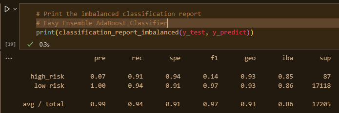

# Credit_Risk_Analysis
Suprervised Machine Learning with Credit Risk Analysis

## Overview of the Credit Risk analysis
Credit risk poses an inherently unbalanced classification problem, as good loans significantly outnumber risky loans. Various techniques have been employed to train and evaluate models with unbalanced classes. A range of libraries and algorithms have been utilized for building and assessing models using resampling, including:

* Imbalanced-learn
* Scikit-learn
* RandomOverSampler
* SMOTE algorithms
* ClusterCentroids algorithm
* SMOTEENN algorithm
* BalancedRandomForestClassifier 
* EasyEnsembleClassifier 

### Purpose

The purpose of this analysis is to demonstrate how machine learning algorithms can be applied in data analytics. This involves creating training and test groups from a given data set and implementing various algorithms such as logistic regression, decision tree, random forest, and support vector machine. The results of these algorithms will be interpreted, and the advantages and disadvantages of each supervised learning algorithm will be compared. This analysis will also help in determining the most suitable supervised learning algorithm for a specific data set or scenario. Furthermore, ensemble and resampling techniques will be employed to enhance model performance.

## Results
The outcomes of the six machine learning models, encompassing their corresponding balanced accuracy, precision, and recall scores, can be summarized as follows:

### Naive Random Oversampling

* Balanced Accuracy: 0.6366972052004142
* Precision (pre): The precision was low for High-Risk loans but was high for Low-Risk loans.
* Recall (rec): High/Low risk = .62/.65

### SMOTE Oversampling

* Balanced Accuracy: 0.6302712208564487
* Precision (pre): The precision was low for High-Risk loans but was high for Low-Risk loans.
* Recall (rec): High/Low risk = .62/.64

### Undersampling

* Balanced Accuracy: 0.6302712208564487
* Precision (pre): The precision was low for High-Risk loans but was high for Low-Risk loans.
* Recall (rec): High/Low risk = .61/.45

### Combination (Over and Under) Sampling

* Balanced Accuracy: 0.5103601371413837
* Precision (pre): The precision was low for High-Risk loans but was high for Low-Risk loans.
* Recall (rec): High/Low risk = .71/.59

### Balanced Random Forest Classifier

* Balanced Accuracy: 0.7877672625306695
* Precision (pre): The precision was low for High-Risk loans but was high for Low-Risk loans.
* Recall (rec): High/Low risk = .67/.91

### Easy Ensemble AdaBoost Classifier

* Balanced Accuracy: 0.925427358175101
* Precision (pre): The precision was low for High-Risk loans but was high for Low-Risk loans.
* Recall (rec): High/Low risk = .911/.94

